# Introduction 

1. Yocto ihereted from Open Embedded project 
The Yocto Project (YP) is an open source collaboration project that helps developers create custom Linux-based systems regardless of the hardware architecture.

2. The project provides a flexible set of tools and a space where embedded developers worldwide can share technologies, software stacks, configurations, and best practices that can be used to create tailored Linux images for embedded and IOT devices, or anywhere a customized Linux OS is needed.  

3. The Yocto Project is not Single Open Source Project.
It is an Ecosystem.

4. In general Yocto is a Build System which Take Source Code and configuraions to provide images:
Which able to generate may be :
 1. BTL image 
 2. Kernal image 
 3. File system image  

 # Advantages of yocto 

1. Complete Build System for Linux OS
2. Releases every 6 months with latest (but stable) kernel
(LTSI), toolchain, and package versions
3. Full documentation representative of a consistent system

4. You can use components from the Yocto Project to design, develop, build, debug, simulate, and test the complete software stack using Linux, the X Window System, GTK+ frameworks, and Qt frameworks.

## How to download yocto
1. go to [yocto webpage](https://www.yoctoproject.org/)

 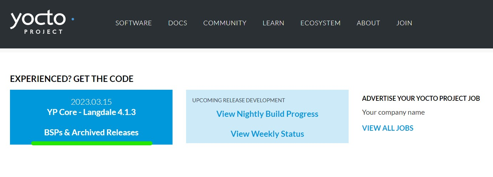

 2. You can clone or download the project 
 
 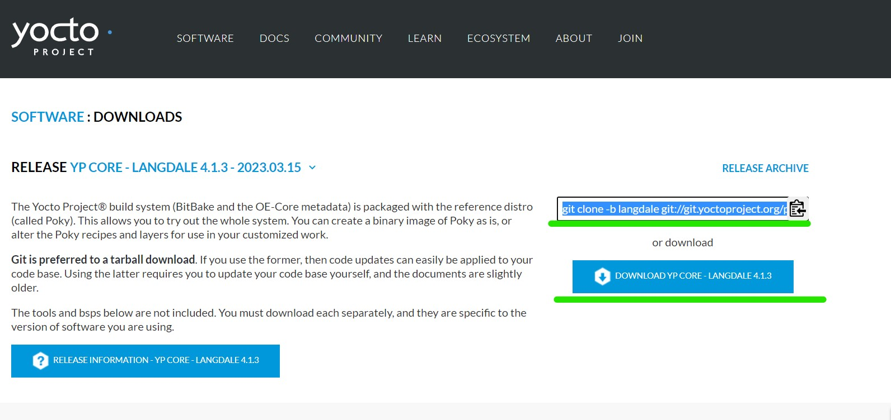

# Yocto Project layerd architecture 

 

yocto project is layerd architecture based which helps in various supprot for different boards and ease of change 

1. Base Layers: These layers contain the core components of the Yocto Project, such as the BitBake build system, the OpenEmbedded build environment, and the Poky reference distribution.

2. BSP Layers: These layers provide support for specific hardware platforms, including board configuration files, kernel drivers, and other hardware-specific components.

3. Custom Layers: These layers are created by developers to add new components or customize existing ones. Custom layers can be shared among teams or with the wider Yocto Project community.

[Note]
Each layer in the Yocto Project is organized into a specific directory structure, with a set of files and folders that define the layer's contents. 

## core components of yocto project 

### Basic termonology: 

1. BitBake: BitBake is the build system looks like make used by the Yocto Project. It reads recipes(Also called meta data) that describe how to build software components and generates a set of tasks to build them,And Bitbake is a python script

2. OpenEmbedded: OpenEmbedded is the build environment used by the Yocto Project. It provides a set of tools and scripts for building software components and assembling them into a complete system image, Simply it is the base layer of yocto

3. Poky: Contains All tools needed to yocto where Poky is the reference distribution created by the Yocto Project. It provides a set of recipes and configuration files that developers can use as a starting point for building custom Linux-based systems.

4. Metadata: Metadata is the collection of recipes, configuration files, and other resources that define how to build each component of a Linux-based system. These resources are organized into layers, each of which provides a specific set of components or functionality.

5. Devtool: Devtool is a set of tools that simplifies the process of creating and modifying software components for use with the Yocto Project. It provides a set of command-line tools that automate many common tasks, such as creating new recipes or modifying existing ones.

These core components work together to provide a flexible and powerful platform for building custom Linux-based systems for embedded devices.

# How Yocto Project works?

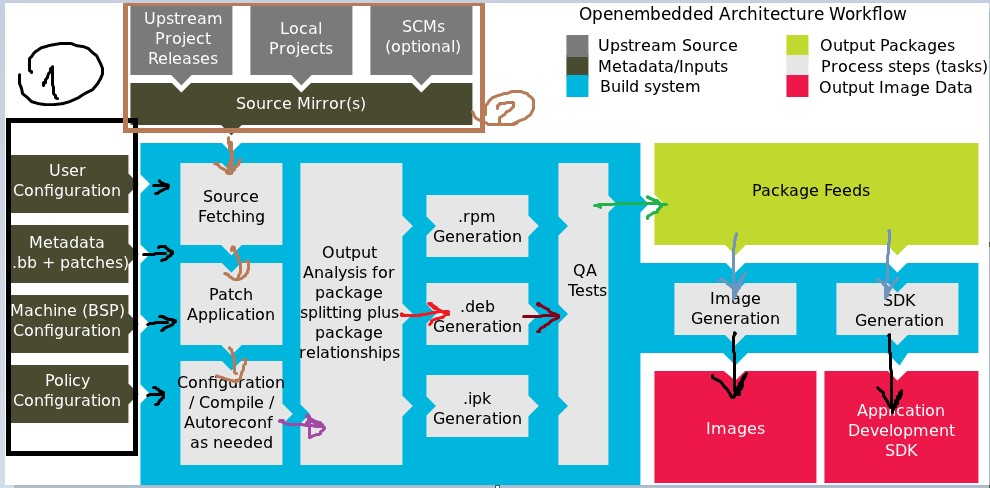

As shown in the atached image : 

1. Yocto receive configurations as following 
   
   - User Configuration 
   - Metadadata and recibes
   - Machine and HW Configurations 
   -  policies that govern how a Linux-based  like security, networking, and system performance.

2. Yocto fetches all needed sources 
3. Patch application 
4. Configure and Compile 
5. Packaging and producing the output in the form of packages 
6. QA:Quilty assurence test for checksum and minimal checks perform beside quility check 
7. Generate Image: For BTL ,ZIMG
8. Generate SDK  SW DEV KIT : Aset of tools bindded with the image to generate binary from it without focusing on the images itself 

# Yocto stages 

## Bitbake parsing 
BitBake parses the target recipe and configurations that has been provided and its dependencies. The outcome is a set of interdependent tasks that BitBake will then execute in order.

A depiction of the BitBake build process is shown in the following diagram:
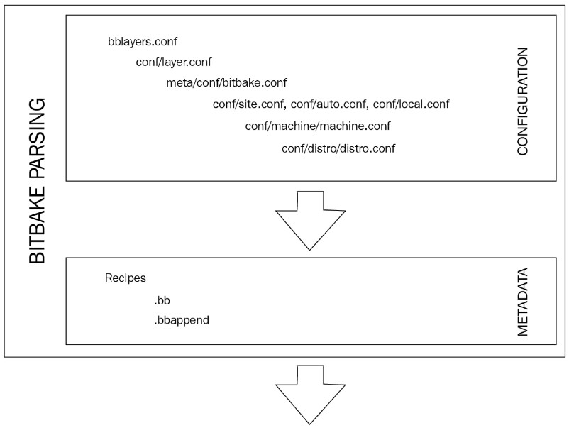

## Bitbake cocking 
As shown in the image the process start as mentiond in the pasrsed recipes to produce sdk or images 
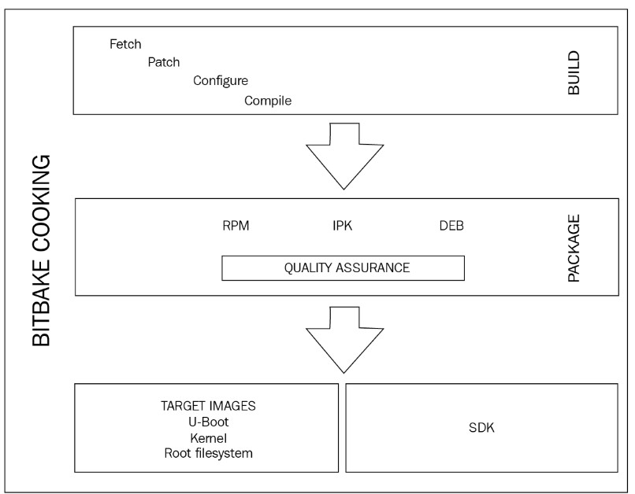

## yocto Directory: 
1. bitbake: Hold all scripts used by bitbake command
2. docummentation Yocto docummentations 
3. meta: Contains Open embedded core metadata 
4. meta-skeleton: Contains Template receipe for BSP And Kernal development 
5. meta-poky : Holds the configurations for Pokey Reference distribution 
6. meta-yocto-bsp: Configuration for the yocto Project reference hardware 
7. LICNSE : The License under whcih poky is distributed GPL Or MIT 
8. oe-init-build-env: Script to setupt the open embedded environment, It will create the build directory, it takes the optional prameter which is build directory name by default build, The script has to be sourced because it changes the environment variables 
9. scripts : Contains Scripts used to setup the environment, development tools,and tools to flash the generated images on the target   

## Bitbake Utility : 
- Run the a fuill build for a given target using `bitbake [target] ` it looks like make, also bit bake can take options : 

 - c <task>: This option allows you to 
  specify a specific task to be executed by 
  - c compile <recipe>" to compile a 
   specific recipe.

 - f: This option tells BitBake to force the rebuild of a recipe, even if it has already been built before.

 - k: This option tells BitBake to continue building other recipes even if one recipe fails to build.

## What should receipe Cntains : 

Receipe is a set of instructions to descripe how to retrive, patch compile, install and generate binary packages for given application 

- it alos define a build or runtime dependencies 
- contians functions that can ru (fetch, configure, compile) which are called tasks like the following : 
  - do_fetch
  - do_unpack
  - do_patch
  - do_configure
  - do_compile
  - do_install
  - do_package
  - do_rootfs

## Where To get layers for your board from 

Follow the following [open Embedded Link](https://layers.openembedded.org/layerindex/branch/master/layers/)
And clone the layer you want for rspberry 
 git://git.yoctoproject.org/meta-raspberrypi

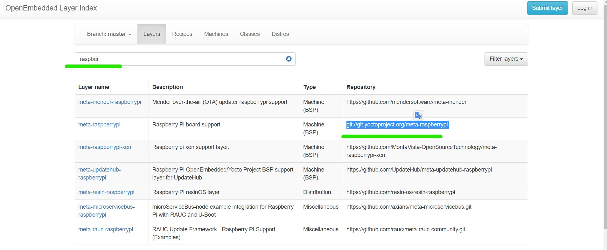

## Yocto build Is based on internet speed so you can run it over a server which is a strong machine : 
  - AWS
  - Azure
  - Google Cloud

## Building Minimal Image For x86 for qemue 

- Clone yocto
- got to pokey and run as following 

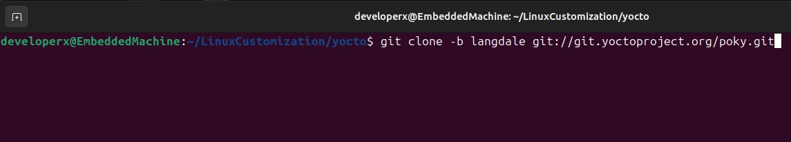
Source the script to save it's variables in the terminal and define the output directory
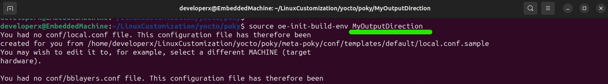
Open the output directory define by yourside 
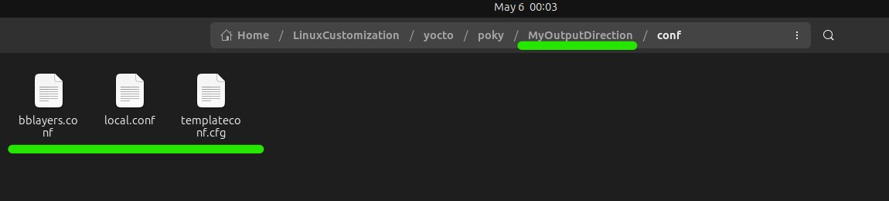
Select the target machine may be raspberry or x86 as you wish 
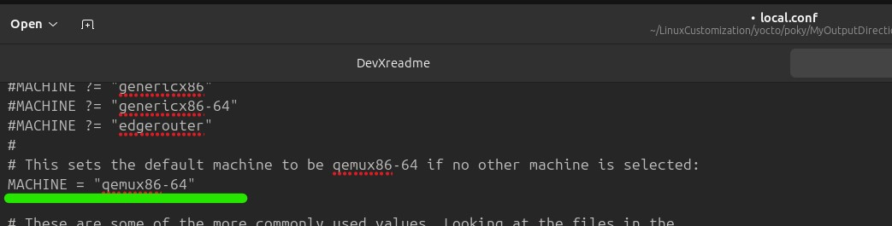

Define number of tasks and thread for BB Bitbake to work with during build 
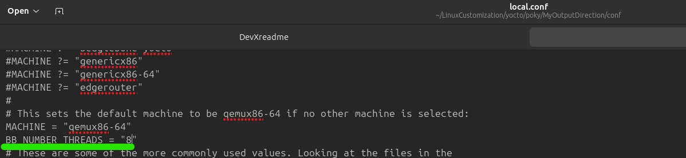

define number of building threads

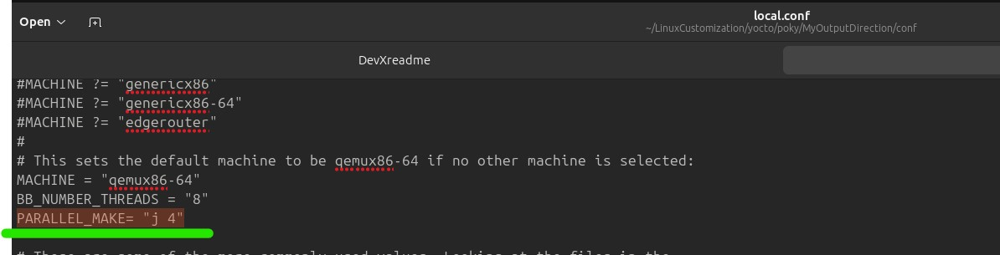

Define the file which you want to be seen in the level of yocto project for example raspberry pi layer can added here 
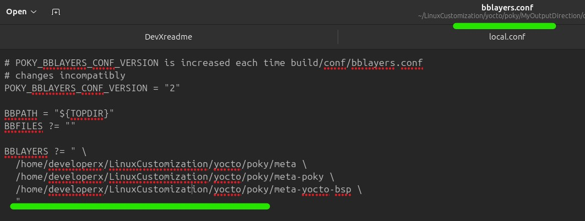

Build : 
